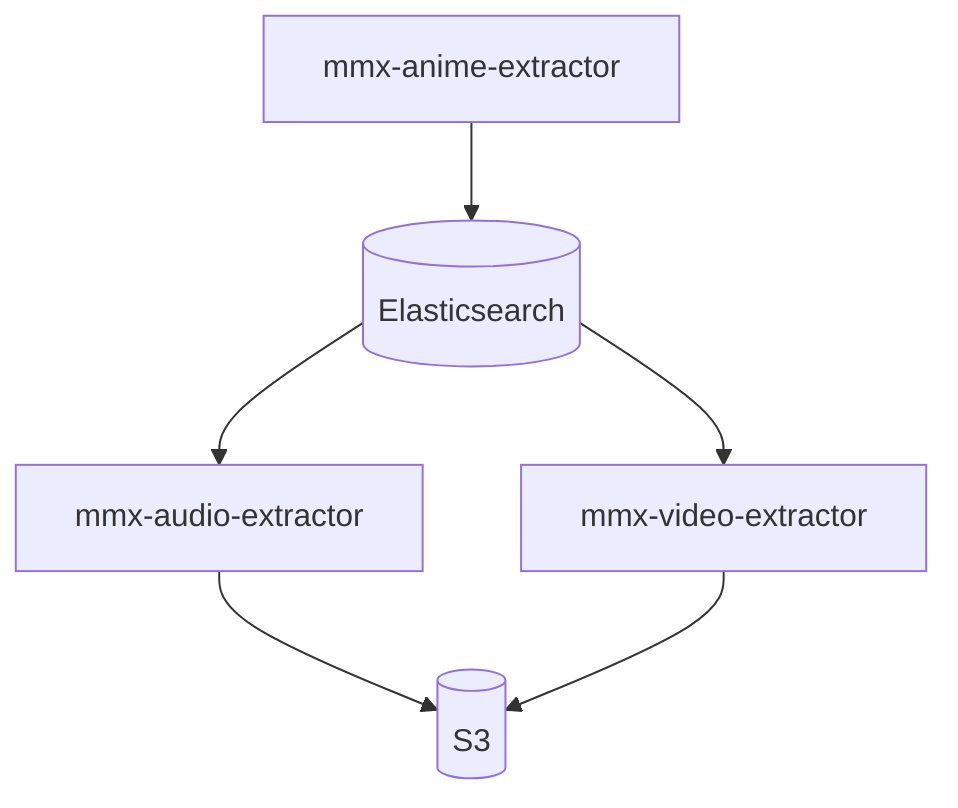
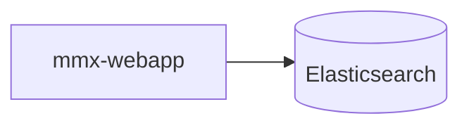

# MangaMix documentation

```
MangaMiX is an application that provide anime sountracks with epic scene.
````

## Backend

This part describe the backend of the MangaMiX application. The backend is a distributed system with micros-services. The projects that compose this part are:

- mmx-anime-extractor
- mmx-audio-extractor
- mmx-video-extractor
- mmx-api

### Tools

The previous projects will use some tools to read and write their data.

- Elasticsearch: Elasticsearch is a search engine based on the Lucene library. It provides a distributed, multitenant-capable full-text search engine with an HTTP web interface and schema-free JSON documents
- Amazon S3: Amazon Simple Storage Service is an object storage service that offers industry-leading scalability, data availability, security, and performance

### Schema



## Frontend

This part describe the frontend of the MangaMiX application. The projects that compose this part are:

- mmx-webapp

### Schema


