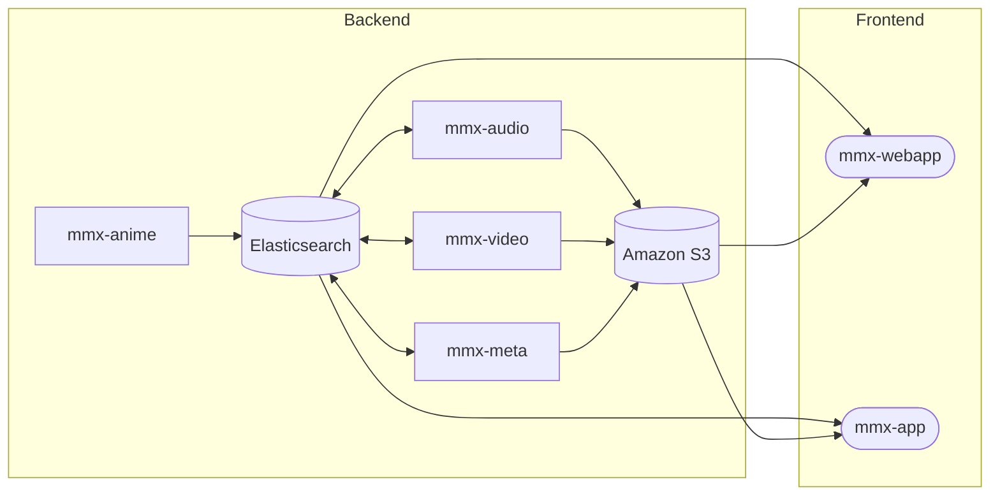

# MangaMix documentation

```
MangaMiX is a streaming platform that provide anime sountracks with epic scenes.
````

## Backend

This part describe the backend of the MangaMiX application. The backend is a distributed system with micros-services. The projects that compose this part are:

- mmx-anime
- mmx-meta
- mmx-audio
- mmx-video
- mmx-api

### mmx-anime

This component is used to retrieve a list of existing anime on websites. Then it will create one elasticsearch document per anime. 

### mmx-meta

This component get all animes indexed in elasticsearch. Then it will extract metadata such as image, themes, synopsis, genres etc... from multiple websites and update elasticsearch documents.

### mmx-audio

This component get all animes indexed in elasticsearch. Then it will extract soundtracks and put them in Amazon S3. Finally it will update elasticsearch document with the links of Amazon S3 soundtracks previously added.

### mmx-video

This component get all animes indexed in elasticsearch. Then it will extract videos based on AMV and put them in Amazon S3. Finally it will update elasticsearch document with the links of Amazon S3 videos previously added.

### Tools

The previous projects will use some tools to read and write their data.

- Elasticsearch: Elasticsearch is a search engine based on the Lucene library. It provides a distributed, multitenant-capable full-text search engine with an HTTP web interface and schema-free JSON documents
- Amazon S3: Amazon Simple Storage Service is an object storage service that offers industry-leading scalability, data availability, security, and performance

## Frontend

This part describe the frontend of the MangaMiX application. The projects that compose this part are:

- mmx-webapp
- mmx-app

### mmx-webapp

This component represents the website.

### mmx-app

This component represents the mobile application.

## Architecture


